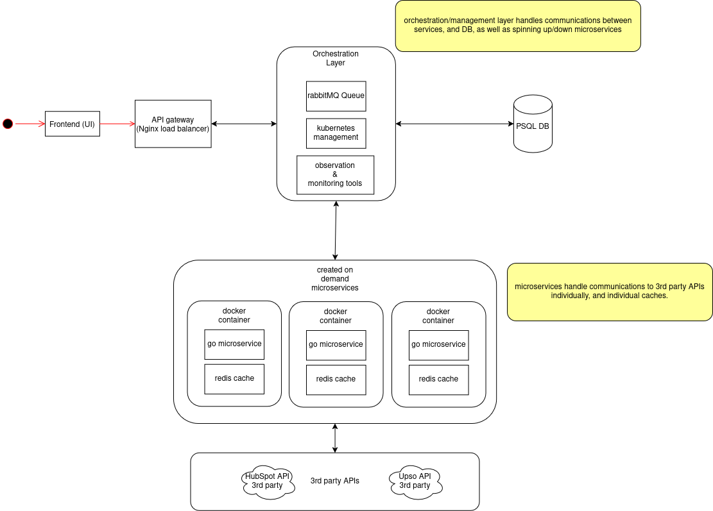

## 1. High-Level Architecture Diagram

- The initial gateway for each deployment is handled by an nginx instance, which acts as a loadbalancer for said deployment.
- The orchestration layer handles the management and scaling of microservice instances,via Kubernetes. This also houses the messaging protocols, managed via rabbitMQ, to enable efficient queueing in requests to and from the database, and external elements.
- The PSQL database exists outside of the docker containers, but exists within a kubernetes cluster, *with* the on-demand microservices. These databases exist as such to reduce duplication and overheads.
- Any monitoring or observational tools exist within the orchestration layer, to enable management and observation of whole clusters, individually.
- Within each docker container, there exists the go microservice, and a redis cache. This microservice contains the business logic, communicating with the DB and processing the user input.
- These microservices also communicate with the 3rd party APIs directly and individually. This may rely on the infrastructure of those external APIs, but reduces complexity and overhead for this service.
- The aforementioned redis cache provides a small buffer of frequent/recent queries, allowing for a faster average response for a user, whilst simultaneously reducing overheads for connections to the DB, and relevant connection pools.
---
## 2. Infrastructure Diagram

- At the highest level, is a global load balancer. This is more than likely a large provider such as AWS,GCP, cloudflare, etc. This directs traffic toward the multi-regional distribution services; these are numerous, and cover multiple regions each.
- The multi-regional distribution service makes routing decisions based on latency, opting for the region with the lowest latency connection.
- Within each region, there are numerous availability zones (AZ). To manage and direct traffic between these, a regional load balancer performs a similar task to the multi-regional distribution service, albeit additionally taking traffic volume into account.
- Each region can have many AZs. And that would be the preferred approach, for redundancy. Each AZ contains it's own load balancer, gateway, orchestration layer, storage solution, and by extension, microservices.
- These are silo'd from eachother, save from failover and communication regarding synchronising the databases. This structure and separation allows for a secure, and resiliant structure - whilst sacrificing some flexibility that could be gained from more inter-communication.
---
## 3. Monitoring and Observability
 - logging & log analysis
    - Logstash: this is a tool for aggregating logs from containers, load balancers and back end services. This is a fairly generic tool, but it serves well for making navigating large, distributed systems more easily.
    - Structured logging: whilst not done in the code implementation, due to it's simplicity; this is a standard method of making a log easy to digest at a glance, showing where it came from, the nature of the log message, and what to infer from it's contents.
 - RabbitMQ Monitoring
    - RabbitMQ comes with a management plugin, which provides:
        - Queue length tracking, which helps detect message build-ups, identifying potential bottlenecks and issues.
        - Consumer lag monitoring, helps prevent and identify slow message processing and their causes.
        - Dead-letter queue handling, for messages that fail repeatedly.
 - PostgreSQL monitoring
    - pg_stat_statements track slow queries, identifying where effort in optimization needs to be directed.
    - pgBouncer is a tool for connection pooling, which helps prevent any overload in connections to the DB
 - Jaeger
 - Jaeger is a tool for tracking request flow across multiple services, which is a really applicable tool for a microservice, event driven system such as this.
 - for example, a request to modify a hubspot deal will go through the api, database and queue, which Jaeger will identify and trace.
 - This granular level of monitoring helps identify high-latency events and failed transactions, by visualising where time is spent throughout transactions.
---
## 4. Programming Languages
 - Backend:
    - I chose Golang for the backend micro-services. I initially boiled my decision down to either using Python (to leverage FastAPI) and golang.
    I decided upon golang, because it has a fantastic support for high concurrency, great garbage collection and highly optimized and performant networking capability.
    For highly network dependant micro-services, these features make for an ideal pick.
 - DB:
    - I chose PostgreSQL for the database. This is due to it's strong consistency guarentees, powerful indexing features, and most importantly: it's support for JSON fields.
    These features are really important for storing data across a system that could grow to any size. The focus on integrity lends to a remarkably reliable system across any width.
 - Deployment & load balancing:
    - for containerization, docker was chosen. This ensures environmental consistency, ease of deployment, and ease of configuration.
    - Redis is for caching API responses, improving performance over time, as each instance will have a cache of recent requests to query before attempting connections to the DB.
    - RabbitMQ was chosen for queueing API calls between instances, this ensures high throughput, in this event-driven architecture.
    - Kubernetes was chosen for orchestration, as it natively supports forms of load balancing, self-healing and high availability; ensuring resiliance and scalability.
    - Nginx was chosen for load balancing and routing at most levels. This is due to it's incredible versatility, and reputation as an industry standard. Nginx provides means of hardenning a system to a phenomenal degree, whilst maintaining virtually unparalleled performance.
---
## Additional Questions:

1. **How would you simplify your system design if Balco wanted to build for low scale (<10 companies)?**

    In order for this to be used at a lower scale, the concept of regions could be completely done away with. The global load balancer could instead communicate to AZs directly, with each being a designated physical/cloud location. This essentially means that each region, is instead just *one* availability zone; reducing the multi-region replication and complex failover mechanisms.
    Conversely, This could be restructured to use a monolithic deployment instead of the microservices approach. Instead of using seperate services for orchestration and queue workers; this could be merged into a single asynchronous Go service.
    This would massively reduce network overhead, API communication latency, and infrastructure complexity and costs.
    Redundancy becomes less vital in a smaller environment, so removing services like the PSQL read replicas and redis would reduce the complexity and overheads.
    If this is a smaller service overall, the use of kubernetes becomes overkill and no longer cost effective. This can instead be done using docker, as there are far fewer moving parts to manage.

2. **What are 2-3 ways you can prevent inconsistent configurations? (e.g. users changing permissions on Hubspot or Upso directly instead of going through GoMark’s orchestration layer)**
    1. Webhook based synchronisation and reconciliation
        - webhooks are registered in Hubspot and Upso to detect direct changes made outside of GoMark
        - whenber a change is detected, trigger a synchronisation process to check for discrepancies
        - if the change is unauthorised, log the event, revert it or alert an administrative user.
    2. Periodic Configuration Audits
        - Cron jobs are run on regular intervals, that fetch current HubSpot/Upso configurations, and compare them against GoMark canonical sources of truth; found in the PSQL DB.
        - If there are differences/discrepancies, either correct them automatically, or generate a report to provide to an admin for manual intervention.
    3. Enforced API Proxy & Role-Based Access Control (RBAC)
        - Block all access to the APIs directly, enforcing mandatory passage through GoMark (acting as a middleware)
        - RBAC ensures only authorised users can modify configurations
        - Block API keys from being used outside GoMark (e.g revoke external API credentials).
        - These tokens can be done via OAuth, or any means of user authentication tokens.

    Ideally, a combination of all 3 would be ideal. As this covers instant changes via web hooks, the scheduled audits catch anything that may have gotten past; and the API enforcement makes unauthorised access more difficult for a would be malicious actor.
